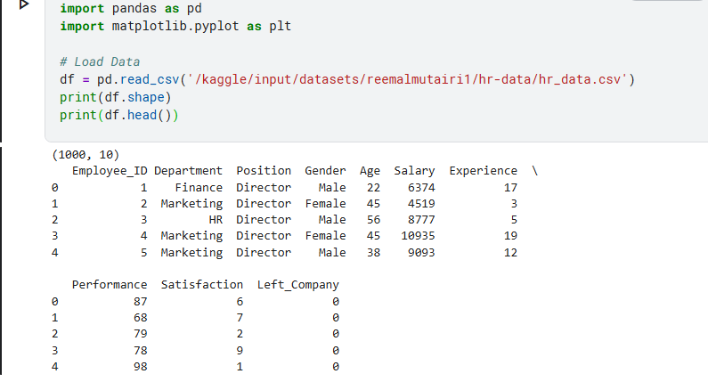
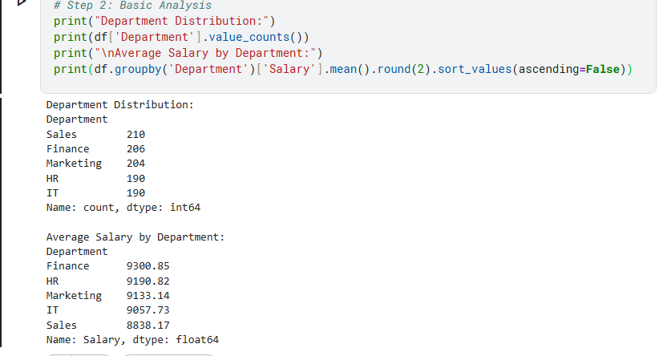
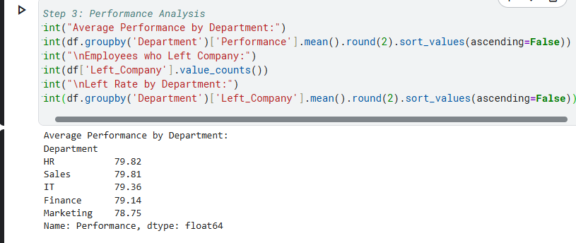
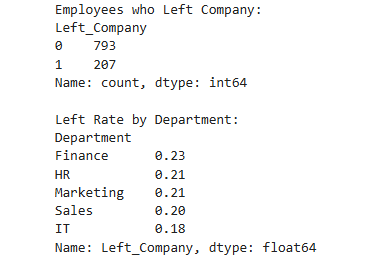
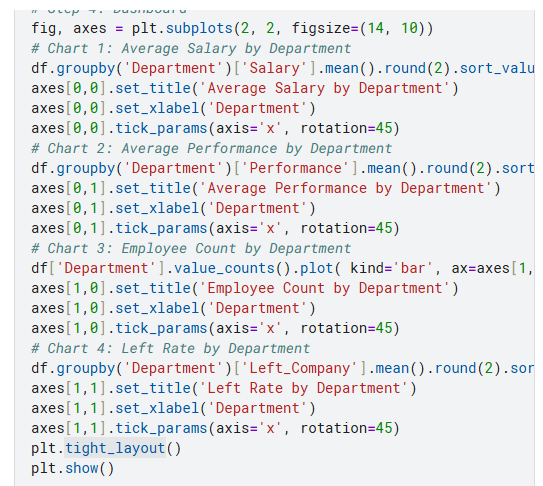
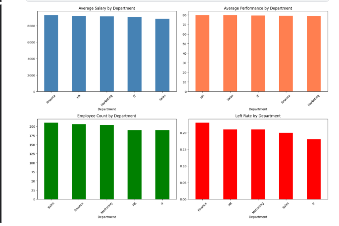
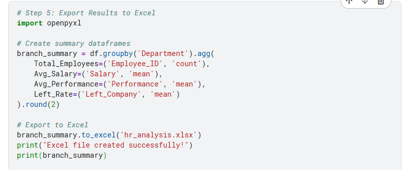
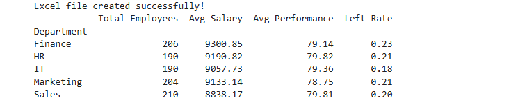
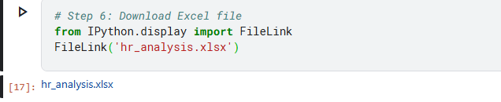
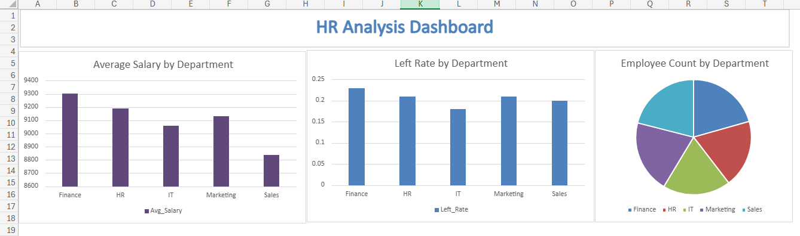

# HR Analysis - Python + Excel

## Problem
Analyze HR data to understand salary distribution, employee performance,
and identify departments with high employee turnover.

## Dataset
- Synthetically generated HR data for analysis purposes
- 1,000 employees
- Departments: Sales, IT, HR, Finance, Marketing
- Columns: Employee ID, Department, Position, Gender, Age, 
  Salary, Experience, Performance, Satisfaction, Left Company

## Tools Used
- Python (Pandas, Matplotlib) : Data analysis and visualization
- Excel : Dashboard and reporting

## Key Findings
- Finance has the highest average salary ($9,300)
- HR has the best average performance (79.82)
- Finance has the highest left rate (23%)
- IT has the lowest left rate (18%)
- Sales has the most employees (210)

## Decision & Recommendations
- Review Finance retention strategy urgently
- Study IT department as it has the lowest turnover
- HR performance model should be applied to other departments

## Analysis Steps & Results

### Step 1: Load Data

### Step 2: Basic Analysis

### Step 3: Performance Analysis

### Step 4: Python Dashboard

### Step 5: Export to Excel

### Step 6: Download Excel File

### Excel Dashboard

## Files
- hr_python_analysis.ipynb : Python notebook
- hr_analysis.xlsx : Excel dashboard
